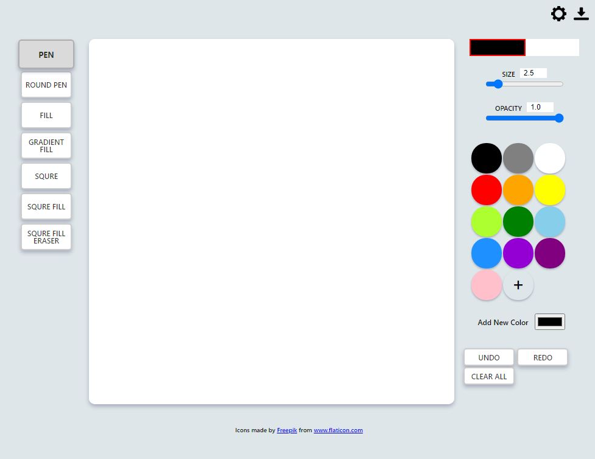

# painting-board

웹에서 사용할 수 있는 페이팅 보드 페이지입니다.  

[▶ 데모 웹사이트](https://mintlib66.github.io/painting-board/)  

개발: HTML, CSS, JS

- header icons(top) : You can change canvas size or download image.
- tool buttons(left) : You can change painting tool.
- canvas(center) : You can paint here.
- controls(right top) : You can change paint size and opacity.
- color palette(right middle) : You can add new color. Also you can change or delete color with right click.
- buttons(right bottom) : You can clear canvas or undo/redo work.
